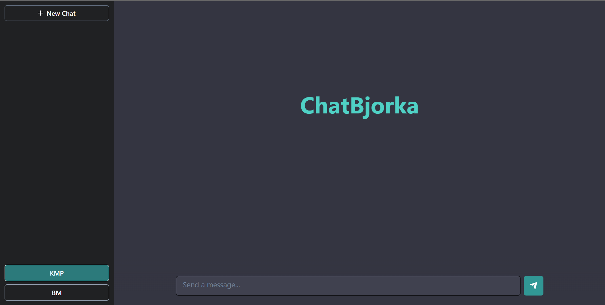

# BukanBjorka

Implementasi algoritma KMP (Knuth–Morris–Pratt) dan BM (Boyer–Moore) untuk pencocokan string dalam program chat bot.

## Table of Contents

- [BukanBjorka](#BukanBjorka)
  - [Table of Contents](#table-of-contents)
  - [Aplikasi algoritma KMP dan BM dalam Chat Bot](#aplikasi-algoritma-bfs-dan-dfs-dalam-treasure-hunt-solver)
  - [Requirements](#requirements)
  - [Cara pemakaian program](#cara-pemakaian-program)
  - [Contoh Tampilan Program](#contoh-tampilan-program)
  - [Project Status](#project-status)

## Aplikasi algoritma KMP dan BM dalam Chat Bot

Dalam chat bot, algoritma KMP atau BM dapat digunakan untuk mencocokkan pola yang terdapat pada input pengguna dengan database jawaban yang sudah diatur sebelumnya. Misalnya, jika pengguna mengirim pesan yang mengandung kata "Halo", chat bot dapat mencari dalam database jawaban apakah ada pola yang cocok dengan kata tersebut, seperti "Selamat datang!" atau "Halo juga!".

## Requirements

- Aplikasi Browser Dekstop (Chrome, Edge, Safari, Firefox, dll) 

## Cara pemakaian program

Karena program dideploy, program dapat langsung dibuka pada https://saddamannais.github.io/Tubes3_13521109/. Adapun cara untuk membuka tautan melalui browser adalah sebagai berikut:
1. Pertama-tama pastikan bahwa perangkat yang digunakan terhubung dengan internet.
2. Buka aplikasi browser seperti Google Chrome, Mozilla Firefox, atau Microsoft Edge.
3. Masukkan alamat "https://saddamannais.github.io/Tubes3_13521109/" pada kolom URL di browser.
4. Tekan tombol Enter pada keyboard atau klik tombol Go untuk membuka link tersebut.
5. Tunggu beberapa saat hingga halaman web selesai dimuat.
6. Setelah halaman selesai dimuat, Anda akan melihat tampilan awal dari program tersebut.

## Contoh Tampilan Program

## Project Status

Disusun Oleh :

Kelompok ChatBjorka

- Rizky Abdillah Rasyid (13521109)
- Saddam Annais Shaquille (13521121)
- Hanif Muhammad Zhafran (13521157)

Project is: _complete_
